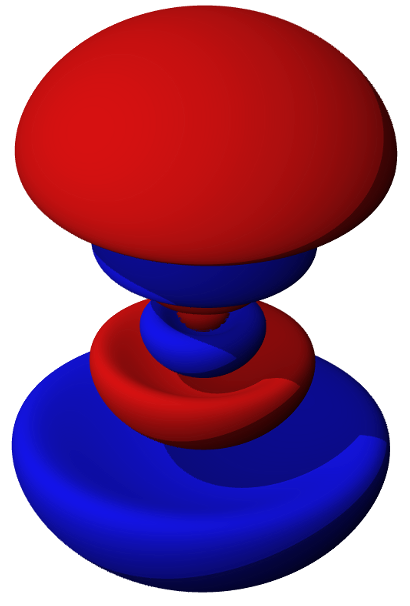

Basic Python
----------------

ATOM - Austin's Thing of the Month
++++++++++++++++++++++++++++++++++
Learning Python

* Austin Godber
* Mail: godber@uberhip.com
* Twitter: @godber
* Source: http://github.com/godber/ATOM

.. raw:: pdf

  PageBreak oneColumn

Online Resources
----------------

* `Hitchhiker's Guide to Python <http://docs.python-guide.org/en/latest/>`_
* `Learn Python the Hard Way <http://learnpythonthehardway.org/>`_

Books
-----

Programming Style
-----------------

* pep8
* pylint
* import this
* pythonic - How to Code Like a Pythonista

Tools & Utilities
-----------------

* pip (easy_install)
* fabric
* ipython & python

Testing
-------

* doctests - examples only
* unittest/unittest2
* web testing (django client, lettuce)

Other Topics
------------

* Math & Science

  * Matplotlib
  * PANDAS
  * Scipy & NumPy

.. header::

        ATOM: Basic Python

.. footer::

        © Austin Godber (@godber), 2013
